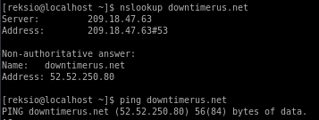

# Route 53 - AWS DNS

Firstly, I'm assuming you already have an AWS account and can log in to AWS Managment Console.

Now, my part in the project was the DNS for our project - Downtime R US -> [downtimerus.net](downtimerus.net)

AWS deals with DNS with their Route 53, which essentially doesn't really differ from a Windows DNS. With my background mainly in Linux and with Linux DNS this was a certain challenge at first, but Route 53 is pretty idiot-proof so pretty quickly even I got a hang of it.

# Domains

Well, first we need a domain to host our project's website, right? So we go to Domains, "Registered domains" on the right side panel and we see that (obviously) we don't have any domains registered at this point.

Click on "Register Domain" button and simply decide on the name and the top level domain. We decided on .net as that was the cheapest option ($11 per year) but .com, .org, or even .adult are all available and your only limit is your own imagination.

Ater checking the availability and confirming the payment option we now patiently wait for Amazon to register the domain for us. That takes anywhere from 5 to 10 minutes.

Congrats! You're now a proud owner of a domain!

# Route 53

Right, so now we go to Route 53. Amazon is smart enough to create a hosted zone for us with some basic information like SOA and NS. Let's add to it a CNAME, for us it was `www.downtimerus.net` as a CNAME for `downtimerus.net`. The biggest problem was to remember it's .net and not automatically, through muscle memory, using .com

Having a domain and a basic hosted zone now we coordinate with however is in charge of our EC2 instances and getting the right public IP. This public IP will be our A record in Route 53, the name part should stay for the apex domain -> downtimerus.net and the IP should be the IP of our EC2 instance.

We can, and we certainly do, play with Elastic IPs and Elastic Load Balancers, but for now since most of it is completely in the testing phases I will not be discussing it. It will be the subject of the next blog post so stay tuned for that!

# Can you hit the server?

Remember that making any changes to Route 53 you should give a few minutes to make sure that all changes went through and were applied. After you wait a few minutes, you can do two things:
1. Open terminal and type `nslookup <your domain name>
2. Go directly through the browser

Option 2 is great if there is an existing webserver on the EC2 instance we're being directed to. In other cases, it won't be of much help. With nslookup showing the right IP, we know we're done here though.

Once you either see your website or see the right IP with nslookup, you know that DNS is correct.

If that is not the case, check if you're using the right IP in the A record and if all other records are correct.

## What's next?

With regards to the DNS? Nothing. We're done for the moment.
Now is the time to help your team with any problems they might be having. It's also the time to start thinking about Elastic IPs, Elastic Load Balancers, and making it easier for the person in charge of EC2 instances to make sure the site is always up.

But that's for next week!
