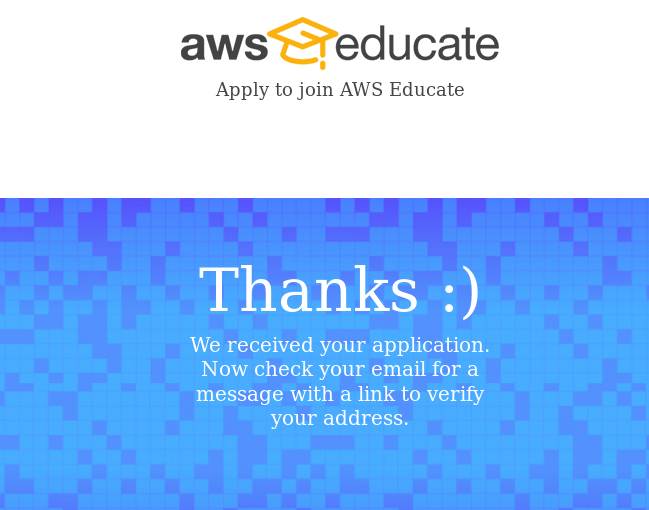

# What Is Ansible?

Let's start by saying that AWS is no the American Welding Society but rather the Amazon Web Services. There's nothing wrong with the welders, but in this particular scenario we will be focusing on the Cloud.

Amazon Web Services (AWS) is the world’s most comprehensive and broadly adopted cloud platform, offering over 165 fully featured services from data centers globally. Millions of customers including startups, largest enterprises, and leading government agencies trust AWS to power their infrastructure, become more agile, and lower costs.

AWS is essentially the future of this industry. Along with Azure, Linode, Google Cloud, and may others...

## I'm a student, I don't want to pay

Perfect! I don't want to pay either! AWS understands that and provides us, poor students, with a clear and easy way to make our lives easier with [AWS Educate](https://aws.amazon.com/education/awseducate/). All you have to do is click on the "Join AWS Educate" button and complete a short questionnaire that will essentially prove you are, in fact, a currently enrolled student. Does AWS check if you are attending school? I actually don't know and they don't say anything about it. Might be they just need you to have a student email, which by now we all probably have.

Follow the instructions to fill out all the right boxes, scroll through their Terms of Agreement (yeah, you actually have to scroll down to the end, they won't let you blindly accept it), and submit it. At the end you'll see this and now you'll have to anxiously wait for an email from AWS either approving or denying your request for the student account:

## What do you get from it?

### Credits

  - AWS Account: $100 in AWS credits per student at member institutions; $40 in credits at non-member institutions
  - AWS Educate Starter Account: $75 in AWS credits at member institutions; $30 in AWS credits at non-member institutions
  - Renewable annually

### Training videos

  - Access to AWS Technical Essentials Training Course (a $600 value)
  - Free access to labs

### Other content

  - Ability to select personalized learning pathway with 30+ hours of content per path
  - Earn digital badges that showcase cloud skills
  - Free access to AWS content for homework, labs, or self-study

### Tools

  - Student Portal access
  - Student portfolio to store projects in one place
  - Access to Job Board and job postings

## One more thing

Apparently now AWS Educate is even extended to High Schools and Secondary students:

AWS Educate is available to students aged 14 and older around the world.* Now, no matter the skill level, AWS Educate can help young students learn fundamental cloud principles. Beginning users are presented with a series of short journeys to learn about cloud technology and how AWS can be used at home and at school. 

