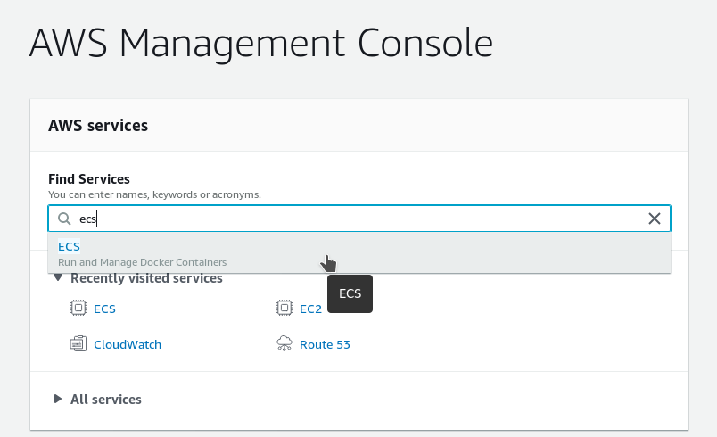
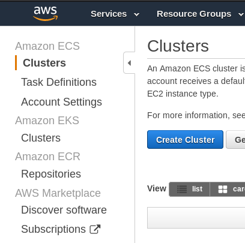
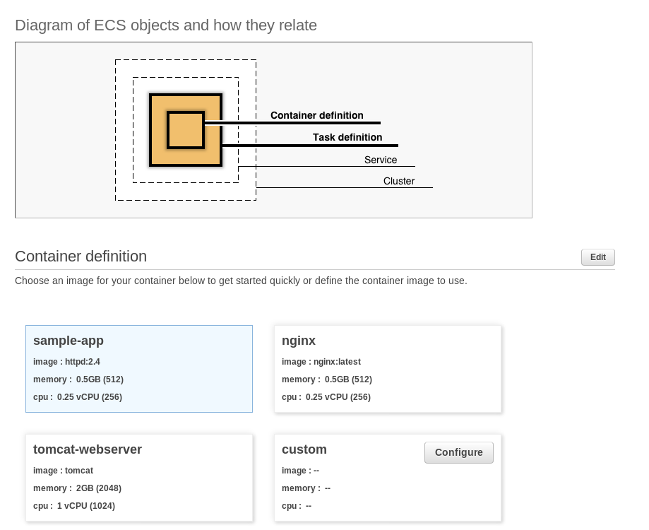
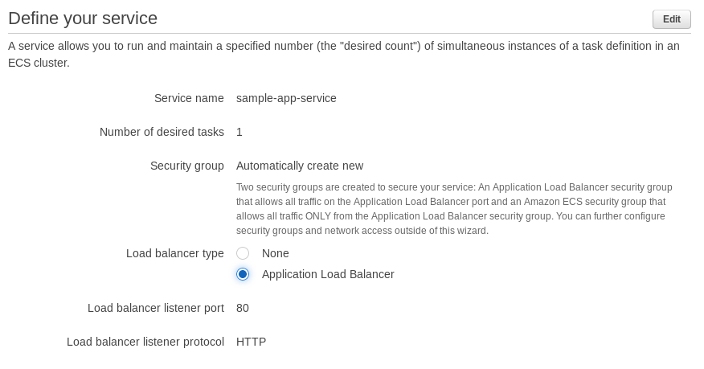
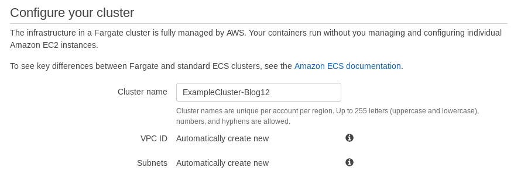

# What is the AWS ECS?

Containers and container administration has been increasingly important for pretty much every IT professional and System Administrator in the field, and all large cloud providers, such as AWS, Google Cloud Platform, or Microsoft Azure, know that this may very well be their next big source of income and establish them as an uncontented leader of the industry. All three of them off a managed Kubernetes cluster solution... but AWS went even further and rolled out Fargate which requires the least amount of maintenance compared to other solutions and is the easiest to learn, as it doesn’t have many concepts to grasp. Auto-scaling is available out of the box and so is the load balancing. The main downside here is the premium that you pay for services compared to ECS...

But we will focus on ECS today. Amazon Elastic Container Service (Amazon ECS) is a fully managed container orchestration service. With ECS, you can launch services that the orchestrator monitors, scales, and restarts when needed. You can also launch tasks, which are one-off containers that serve a specific purpose but are relatively short-lived. ECS is much simpler than Kubernetes, making it a better choice if you don’t require Kubernetes’ advanced concepts. It’s also a better choice if you want an easier learning experience.

ECS is a great choice to run containers for several reasons. First, you can choose to run your ECS clusters using AWS Fargate, which is serverless compute for containers. Fargate removes the need to provision and manage servers, lets you specify and pay for resources per application, and improves security through application isolation by design. Second, ECS is used extensively within Amazon to power services such as Amazon SageMaker, AWS Batch, Amazon Lex, and Amazon.com’s recommendation engine, ensuring ECS is tested extensively for security, reliability, and availability.

Since it’s the oldest orchestrator AWS offers, ECS is also the best integrated with the rest of the AWS ecosystem. If you’re already familiar with AWS services, such as Application Load Balancing and Elastic Container Registry, you’ll have less trouble setting up and managing ECS. Especially if you're trying to automate the whole project, perhaps with Terraform.

# How to access it?

1. Log in to your AWS account
2. In the "AWS Management Console" search for ECS
3. That's it. You're in

When accessing the ECS, on the right hand side you will notice the other services we just talked about - ECS, EKS, ECR, and the Amazon Marketplace for subscriptions

# Creating a Cluster

AWS is nice enough to give you an easy step by step, starting with a simple graph to help you visualize how clusters work and how they relate to containers themselves

Additionally, when you click next and proceed to actually define your service running on the containers in your new cluster you will be able to just select "yes" on the question about Load Balancers... and one will be created for you making it really easy to bring down the total time needed for the deployment down to mere minutes and one console

You might say "it's not going to be one console! What about the whole networking side?" and all I have in reply is the screenshot below. Yes, AWS will create VPC and subnets for you as well!

Now the only thing that's left is review to make sure it's correct, and click "create" and your ECS Cluster will come to life in a matter of minutes.

Good job!
