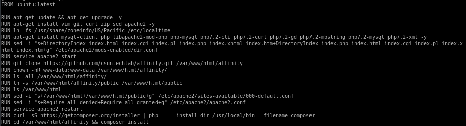

# Dockerfile Makes Life Easier

Have you created countless of docker containers and now you're dreading doing it all over again, because every time you need to configure the container over and over again? Well, you will certainly enjoy Dockerfiles. They are essentially a list of commands your system will perform while building your new docker container. This way, every time you build a new docker container it will be exactly the same, with all software installed just the way you like it.

## How to build a Dockerfile?

Since Dockerfile is just a text file, just like almost anything else on Linux, you can write one yourself! No proprietary software needed, no specialized knowledge necessary! Let's get to it:

First you will always wanted to start with a `FROM` element, in our example it would be `FROM ubuntu:latest`. This will always pull the latest version of Ubuntu from Docker's repository, and will save you from wondering if it's okay that your docker container still runs Ubuntu 12.04.

Next part are updates. You don't want to waste time later installing updates if you can just install them while the container is being built. This could be achieved by a simple `RUN` command, resulting in `RUN apt-get update & apt-get upgrade`. Since by default docker is being built as root user you don't need to use `sudo` in your commands.

Following the updates, time comes for all other software you might need. This includes zip, git, wget, vim (the best ever text editor for Linux, can't argue with that), apache2, curl etc. Installing all this now means that after building up the container, you don't have to worry about installing anything else, and we already know the command - `RUN <command>`

Of course, sometimes files need to updates, changed, modified towards your end goal. While there are many different approaches to it, including using `scp` command to securely copy an existing configuration from another server and override your existing config file, or using `cp` and copying the config file from your main OS into the docker container you're creating. Those approaches are interesting and certainly worth looking into, however, to not depend on other files, other servers, other config files we will be using `sed` instead. The `sed` command is incredibly powerful for inline modifications, and while syntax can be daunting at first, it's easy to get into. First let's talk about the syntax:

Generally, all `sed` examples will include "/" as a delimeter, however, `sed` doesn't actually require you to use this particular symbol. In fact, `sed` **only** requires you to use **the same** delimeter throughout your code. That means you can use any delimeter you want. In below example I'm modifying a path, so using "/" would simply not work, which is why I'm using "+" instead.
`RUN sed -i "s+Require all denied+Require all granted+g" /etc/apache2/apache2.conf`
As before we're starting with `RUN` command, then we're passing `sed` command with `-i` flag for inline changes to the file itself, then immediately delimeter "+" to symbolize beginning of the regex, then the string you're looking for, delimeter again, and the string you want to update the document with. `+g` at the end serves as "update all instances of this string." At the end of the command we're passing the path to the file we want to modify.

The only other things we need to be concerned about are `RUN service apache2 restart` in order to update the config files and run the correct apache2 instance on our machine.

The end result of this Dockerfile would look similarly to:

