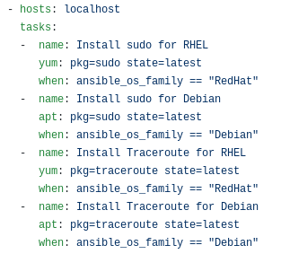

# What Is Ansible?

Ansible is a simple IT automation engine to automate cloud provisioning, configuration management, application deployment, intrastructure orchestration, and many other IT needs. It has been designed for multi-tier deployments since day one, and rather than just managing one system at a time, Ansible models your IT infrastructure by describing how all of your systems interact and relate to each other. It uses no agents and no additional custom security infrastructure, so it's easy to deploy - and most importantly, it uses a very simple language (YAML, in the form of Ansible Playbooks) that allow you to describe your automation jobs in a way that approaches plain English

## Starting with Ansible

First of all, let's install Ansible so that we can actually do anything with it
`sudo apt-get install ansible`
or
`sudo yum install ansible`

From here on now the configuration files will be in `/etc/ansible/` including the ansible.cfg and the hosts file. The hosts file will be very important, very soon.

## Beginning on how to create a playbook

Usually, we'd start with creating a "hosts" file that tells our Ansible server which servers it is supposed to connect to and where to push updates or configurations, however, in this example we will be simply testing our solution on localhost, and so we don't actually need a hosts file. All we need in this example is a simple: `- hosts: localhost`. Why? If the hosts are not specified at all Ansible will most likely throw an error and we will not get anywhere with it.

As mentioned before Ansible uses simple language for it's configuration files, and it is all human readable, and easy to modify. For example to install sudo and traceroute on RedHat-based systems and Debian-based systems all we need is:

Additionally, Ansible makes it possible for us to install multiple files in one command, if we just use its listing capability:

Ansible provides you with a way to create users, groups, whole configuration files, to install or remove software, to change network and firewalls. It is a complete package and can change your life and your infrastructure with a snap of a finger. The only major problem I ran into over the course of 30 hours I spent on this assignment was the indentation. Let's take a look at the beginning of the file:

It starts on the left side, and then using spaces (NO TABS) you move the next line 2 spaces in, and then allign each "-" the same way, and all other text is again indented 2 spaces in. Several tests have failed just because of this, and it took me quite a while to figure out how to do this the proper way.

## We wrote it, what now?

This is both the easiest and the hardest thing - run it.
You can run the playbook by simply doing: `ansible-playbook playbook.yml` or you can check the affected hosts by using `ansible-playbook playbook.yml --list-hosts`. In our example, since we only use it on localhost, the whole command would be `ansible-playbook --connection=localhost playbook.yml`

## Additional resources
[Intro to playbooks](https://docs.ansible.com/ansible/latest/user_guide/playbooks_intro.html)

[Roles in playbooks](https://ansible-docs.readthedocs.io/zh/stable-2.0/rst/playbooks_roles.html)
