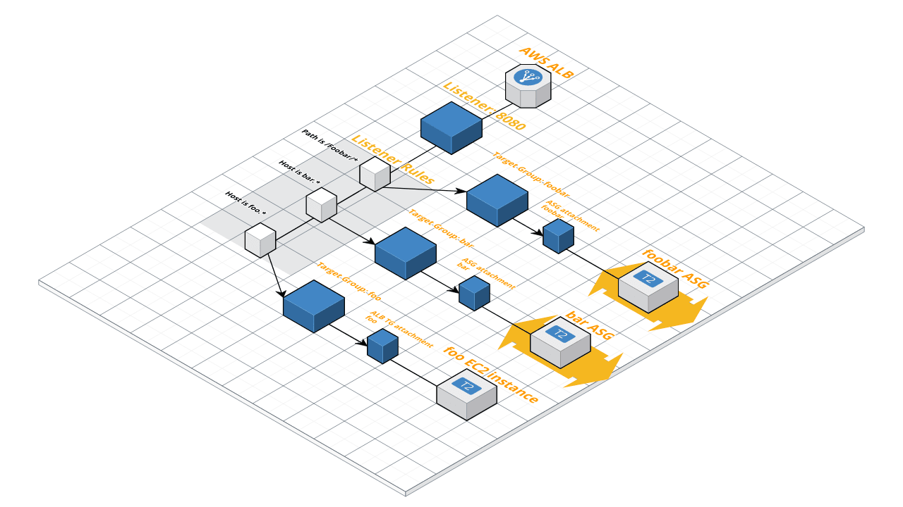

#What is Terraform?

For the more detailed answer, please see the previous blog (blog7) for [What is Terraform?](https://marcin-wski.github.io/SeniorDesignBlog/Terraform-Intro) It will provide the basic understanding of what Terraform is, what features does it include, and just how is it connected to AWS.

#Detailed Application Load Balancer

Let's first just have a look at the detailed diagram of all the moving parts. Some of there were not present in its predecessor, the ELB (or the "classic" load balancer)



Let’s look in more detail what each part is and it’s function while throwing out some nice and handy terraform code snippets. Code below is more or less a basic code example for setting up the AWS Application Load Balancer with Terraform and AWS Lambda

```
resource "aws_lb" "test" {
  name               = "test-lb-tf"
  internal           = false
  load_balancer_type = "application"
  security_groups    = ["${aws_security_group.lb_sg.id}"]
  subnets            = ["${aws_subnet.public.*.id}"]

  enable_deletion_protection = true

  access_logs {
    bucket  = "${aws_s3_bucket.lb_logs.bucket}"
    prefix  = "test-lb"
    enabled = true
  }

  tags = {
    Environment = "production"
  }
}
```
# Classic Load Balancer

The "classic" load balancer (usually abbreviated as ELB) is an older solution and might not include the same usability... but at least it lets you immediately set up everything you need, including multiple listeners, the health check, and the instances connected to it. See the example of the code below, and don't get scared because it's longer. It's actually a lot easier to understand and write.

```
# Create a new load balancer
resource "aws_elb" "bar" {
  name               = "foobar-terraform-elb"
  availability_zones = ["us-west-2a", "us-west-2b", "us-west-2c"]

  access_logs {
    bucket        = "foo"
    bucket_prefix = "bar"
    interval      = 60
  }

  listener {
    instance_port     = 8000
    instance_protocol = "http"
    lb_port           = 80
    lb_protocol       = "http"
  }

  listener {
    instance_port      = 8000
    instance_protocol  = "http"
    lb_port            = 443
    lb_protocol        = "https"
    ssl_certificate_id = "arn:aws:iam::123456789012:server-certificate/certName"
  }

  health_check {
    healthy_threshold   = 2
    unhealthy_threshold = 2
    timeout             = 3
    target              = "HTTP:8000/"
    interval            = 30
  }

  instances                   = ["${aws_instance.foo.id}"]
  cross_zone_load_balancing   = true
  idle_timeout                = 400
  connection_draining         = true
  connection_draining_timeout = 400

  tags = {
    Name = "foobar-terraform-elb"
  }
}
```
