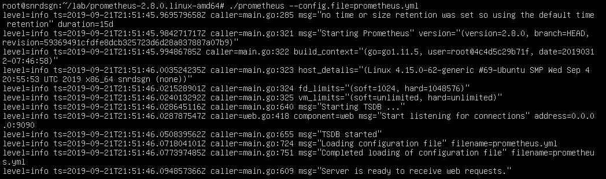
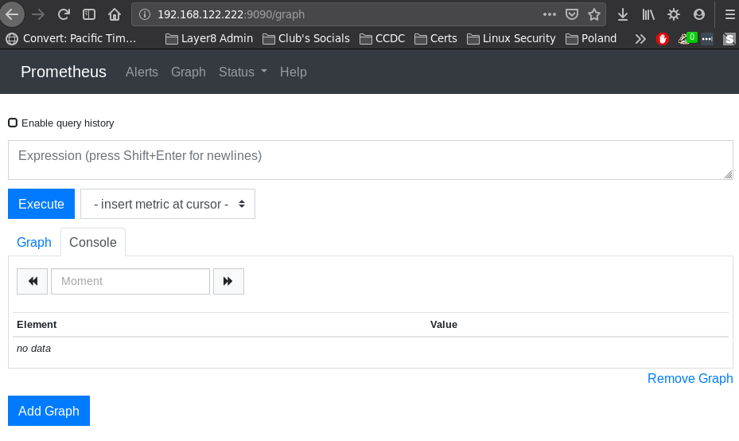
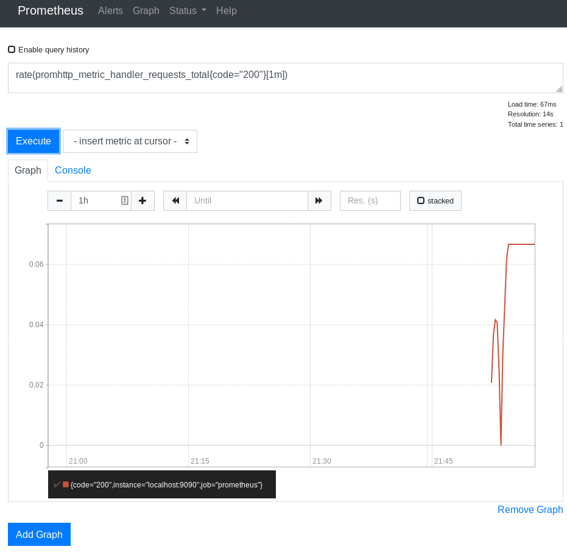
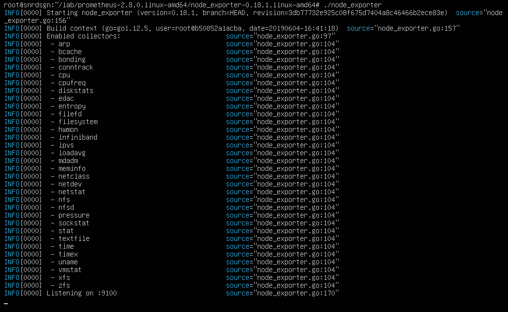
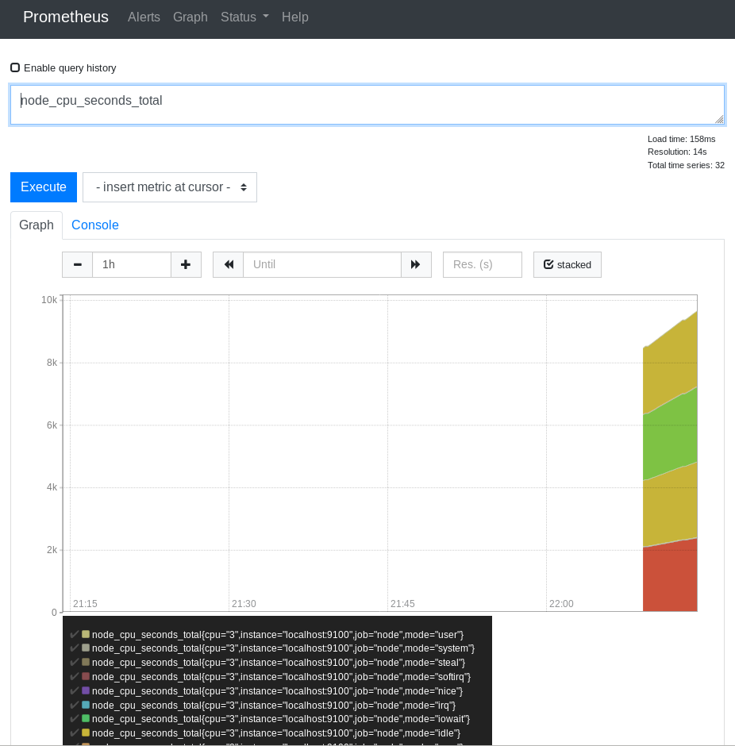

# First of all... what is that?

Prometheus is an open-source systems monitoring and alerting toolkit created in 2012. It is now a standalone open source project and maintained independently of any company. To emphasize this, and to clarify the project's governance structure, Prometheus joined the Cloud Native Computing Foundation in 2016 as the second hosted project, after Kubernetes.

Prometheus's main features are:
..*a multi-dimensional data model with time series data identified by metric name and key/value pairs
..*PromQL, a flexible query language to leverage this dimensionality
..*no reliance on distributed storage; single server nodes are autonomous
..*time series collection happens via a pull model over HTTP
..*pushing time series is supported via an intermediary gateway
..*targets are discovered via service discovery or static configuration
..*multiple modes of graphing and dashboarding support

## Starting with Prometheus

First of all let's actually download Prometheus tarball so we can install it:
`wget https://github.com/prometheus/prometheus/releases/download/v2.8.0/prometheus-2.8.0.linux-amd64.tar.gz`

Now we just need to un-tar this and... we're more or less done. We can now start running Prometheus monitoring server with a simple `./prometheus --config.file=prometheus.yml` and best part? You don't even have to modify anything in the configuration file at the beginning. It just works and this is what we'll see:

&nbsp;

&nbsp;

If we open localhost:9090, where Promethous runs by default we will see a simple entry for an expression or query we want to monitor:

&nbsp;

&nbsp;

Let's add a simple monitoring graph so we can 100% confirm everything work the way we need it to work
`rate(promhttp_metric_handler_requests_total{code=”200”} [1m]`

If we now reload the page with that expression added we will actually see it being monitored already:

&nbsp;

## The Node_Exporter part

The Prometheus Node Exporter exposes a wide variety of hardware and kernel related metrics, and we can download it from [Node_Exporter site](https://prometheus.io/download/#node_exporter) or with wget from the terminal. As soon as we have it download and un-tarred we can run it with `./node_exporter` and it will run alongside Prometheus on port 9100, just like that:

&nbsp;

&nbsp;

Now it's time to quickly modify Prometheus' config file's "scrape_config" part with:
Scrape_configs:
  - Job_name: ‘node’
    static_configs:
  - Targets: [‘localhost:9100’]

After modifying this configuration file all we need is opening the monitoring page on localhost:9090 (yes, Prometheus needs to be still running on your server throughout all this) and in the expression input box we need to add "node_cpu_seconds_total" and switch to the graph view. Depending on the number of CPUs you have currently available it should look more or less like this:
&nbsp;

## Additional resources
[Prometheus Docs](https://prometheus.io/docs/introduction/overview/)
