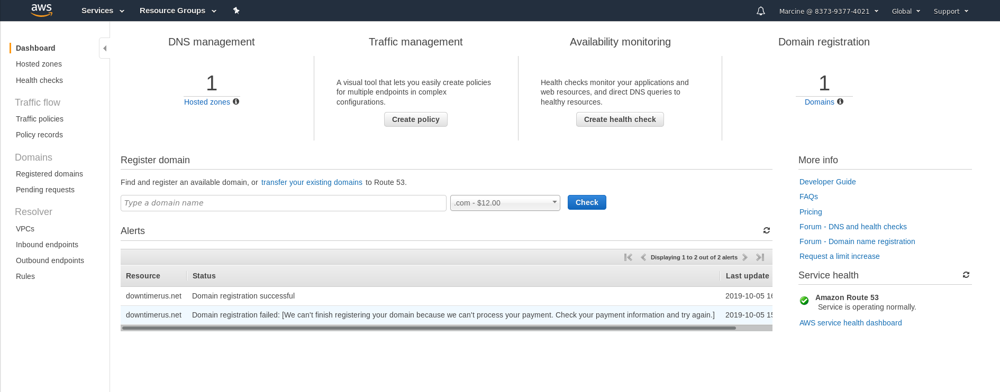
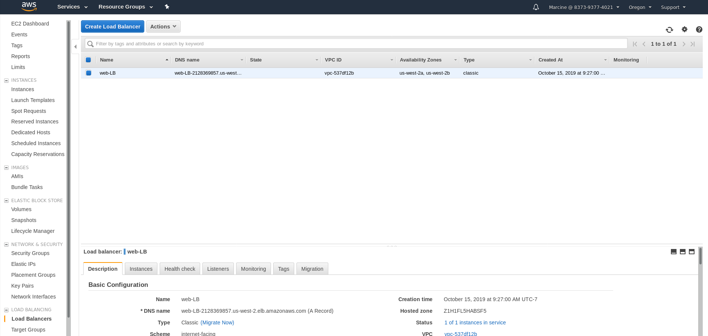
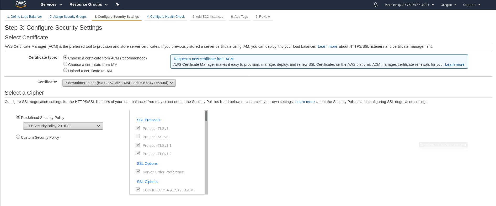
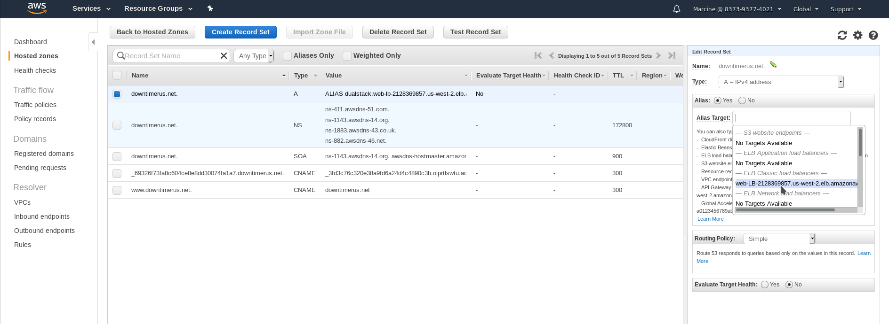

Log into the AWS Management Console and type in to search `Route 53`, you should see something similar to the picture below:

Now, the first thing you should be looking into when creating the DNS infrastructure, which really is one of the most important thing in your whole infrastructure and one of the key pieces that makes your whole operation functional, is the domain. Do you have a domain already? Great. If you do not, AWS will help you with this as well. First let's click on `Registered domains` on the right side

On the picture you see we already have the domain, however, you will also notice `Register Domain` and `Transfer Domain` buttons on the top. If you have an already existing domain, consider transferring it to AWS. If you do not have a domain yet, click on the first button

Choose your name carefully as this is where your customers go in the future and that is how you will be, essentially, known later. For the purpose of this documentation we will create a new domain and click `Check` to see if it's actually available

Perfect! Choose the top level domain you like, click `Add to cart` and continue. AWS will ask you for your contact information so that they can let you know when the domain is registered and ready. Once that happens visit your Route 53 Hosted Zones again, you should see your domain already there

If we investigate further and click on the domain name, we'll see that it already has some records for SOA and NS. By registering your domain in AWS those two records will be automatically created. Add two records to make this work -> CNAME and A. CNAME records will point from `www.<your-domain>.net` to `<your-domain>.net`, or to your Apex domain. The A record will point to the IP address of your webserver to actually make your website available to the public

You will notice that on the picture the A record is not actually an IP. That's right. To ensure that the DNS entries will not have to change as we continue working on the infrastructure you have two choices - Load Balancer or Elastic IP. Load Balancer is a better choice if you have multiple EC2 instances serving your website. Let's go to EC2 management and click on `Load Balancers` on the right

Click on `Create Load Balancer` on the top and you will be presented with a choice between three different load balancer types - Application, Network, or Classic. Both Application and Classic are fine for a webserver, but let's go ahead and create a classic one

Give the load balancer a name, choose the right VPC you want to use, assign the right protocols (HTTP and HTTPS for the webserver) and continue on

It will now ask you to assign the security groups, either choose the one you already use, or create a new one just for the Load Balancer

Continuing on it will ask about the security settings (if you have an HTTPS listener. If you don't skip this step). Do you have an already existing ACM certificate? If not, you can request it through ACM. Click on the AWS logo in upper right corner, search for `ACM` (it will show up as Certificate Manager) and request a new certificate. To request a new certificate you will have to provide ACM with your domain name. AWS will ask you if you'd like to confirm the domain with DNS or with Email. Confirming with DNS is easier and quicker, especially since you are setting up the DNS infrastructure right now anyway and it'll help you do that. Once you request the validation with DNS and let AWS create the right records you should see a new CNAME in your route 53.
We will continue here assuming that you have your certificate an your screen looks similar to this:

Next? Health Check. That's the easiest. You could just click continue without modifying anything. Ping protocol should stay HTTP with port 80. The advanced details can be changed to the values you prefer, such as longer timeout and shorter intervals to make sure all your health checks will be coming back OK. See below for default configuration

The last part you really have to configure in any way (unless you want to set up specific tags) is adding the instances

Once that's all done go back to Route 53 to finalize the DNS infrastructure you're setting up. Click `Create Record Set` on the top, choose type A, and click Alias - Yes. When you click on the Alias Target field you should see something like this:

Your DNS in now set up and ready. Check your website, if it's not showing up, discuss it with the person in charge of the EC2 instance(s), make sure that Security Groups are fine, and see if the person in charge of VPC has correctly set up the VPC. Your DNS should be in perfect state.
